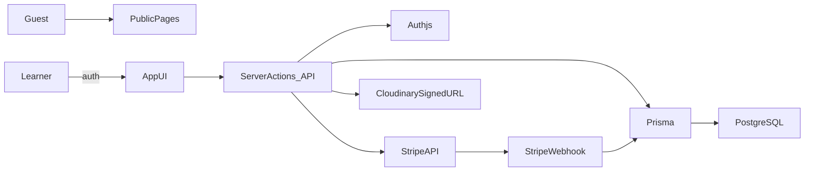

# SYNAPZE MVP Build Plan

## Scope

- Greenfield build focused on MVP core: auth, courses, purchases, pay-gated access, learner library, and progress tracking.
- Payment provider: Stripe only.
- Auth: Auth.js with Credentials (email/password) and JWT/session hybrid.

## Architecture Overview

- Next.js App Router with server components and server actions for protected data flows.
- Prisma + PostgreSQL (Neon recommended) with strict relational integrity.
- Stripe Checkout + webhook verification for granting access.
- Cloudinary for media URLs; signed URL generation behind server actions.

## Key Files/Dirs To Add

- App: [`app`](app) with public pages and authenticated dashboard routes.
- Auth: `[app/api/auth/[...nextauth]/route.ts](app/api/auth/[...nextauth]/route.ts)`, [`lib/auth.ts`](lib/auth.ts).
- Payments: [`app/api/webhooks/stripe/route.ts`](app/api/webhooks/stripe/route.ts), [`lib/stripe.ts`](lib/stripe.ts).
- Access control: [`lib/rbac.ts`](lib/rbac.ts), [`lib/access.ts`](lib/access.ts) for `hasPurchased()` checks on server actions.
- Prisma: [`prisma/schema.prisma`](prisma/schema.prisma) and [`prisma/seed.ts`](prisma/seed.ts).
- Core UI: `[app/(public)](app/\\\\(public))`, `[app/(app)](app/\\\\(app))` with shared layouts.

## Implementation Steps

1) Bootstrap Next.js app (App Router, Tailwind, shadcn/ui) and basic layouts for public vs authenticated routes.

2) Implement Auth.js credentials flow with secure password hashing, JWT/session config, and server-side role enforcement.

3) Define Prisma schema for users/roles/courses/sections/lessons/purchases/enrollments/progress and run initial migrations.

4) Implement course catalog and detail pages (public), course library (authenticated), and lesson viewer with progress tracking.

5) Add Stripe Checkout flow and webhook verification to grant purchases, then enforce `hasPurchased(courseId)` in server actions.

## Access Control (Server-side)

- All lesson content and signed media URLs served from server actions/API routes after `hasPurchased()` + role checks.
- Public routes show previews only (no full media URLs).

## Testing/Verification

- Manual flows: sign up, buy course via Stripe test mode, confirm webhook grant, access course, update progress.
- Verify unauthorized access cannot fetch lesson content or files.